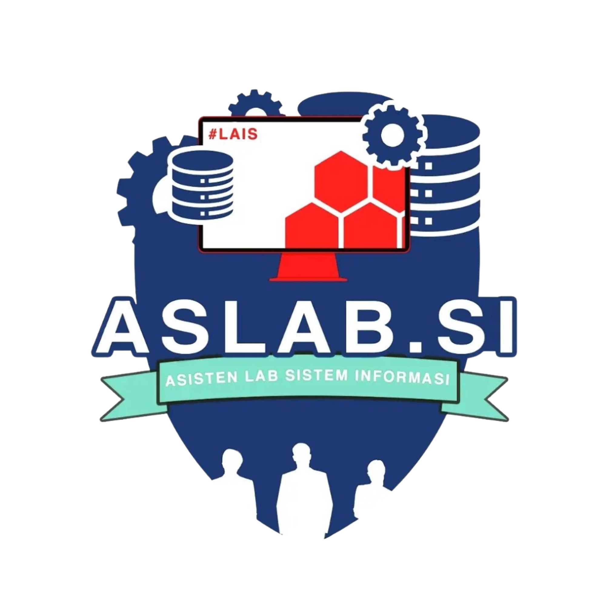

<div align="center">
  
  <h1 align="center">PRAKTISI UNMUL</h1>
  <p align="center">
    <strong>Pra</strong>ktikum <strong>Ti</strong>kungan <strong>Si</strong>stem Informasi — Universitas Mulawarman
  </p>
  <p align="center">
    Sistem informasi praktikum terpadu berbasis web untuk Program Studi Sistem Informasi Fakultas Teknik Universitas Mulawarman.
  </p>
  <p align="center">
    <a href="#features">Features</a> •
    <a href="#tech-stack">Tech Stack</a> •
    <a href="#getting-started">Getting Started</a> •
    <a href="#screenshots">Screenshots</a> •
    <a href="#license">License</a>
  </p>
</div>

<br />

<p align="center">
  
  
  
  
  
  
  
</p>

---

## Features

### 🏠 Public Pages
| Feature | Description |
|---|---|
| **Landing Page** | Hero carousel with auto-play, services section, latest news feed |
| **Jadwal Praktikum** | Browse practicum schedules by subject, class, and room |
| **Berita & Pengumuman** | News listing with pagination, detail view, and category filters |
| **Dokumen Pendukung** | Downloadable practicum documents and guidelines |
| **Pengajuan Surat** | Online letter submission for practicum permits and official documents |
| **Pengaduan** | Submit complaints, aspirations, and feedback |
| **Kontak Kami** | Contact information and social media links |
| **Tentang** | About page with management team and subject coordinators |

### 🔐 Admin Dashboard
| Feature | Description |
|---|---|
| **Berita CRUD** | Create, edit, delete news with thumbnail uploads |
| **Pengurus Manajemen** | Manage core team and subject coordinators with photo cropping |
| **Jadwal Manajemen** | Manage subjects, classes, rooms, and schedule entries |
| **Surat Manajemen** | Approve/reject letter submissions with preview and PDF download |
| **Pengaduan** | Mark complaints as discussed, toggle status, presentation mode |

### 🎨 Design Highlights
- **Inertia.js SPA** — seamless page transitions without full reloads
- **Tailwind CSS 4** — modern utility-first styling with custom theme
- **Material Symbols** — clean, consistent iconography
- **Full Responsive** — mobile, tablet, and desktop optimized
- **Dark Footer** — contrasting footer with social links and contact info

---

## Tech Stack

<table>
  <tr>
    <td align="center"><b>Frontend</b></td>
    <td>React 19, TypeScript 6, Tailwind CSS 4, Vite 7</td>
  </tr>
  <tr>
    <td align="center"><b>Backend</b></td>
    <td>Laravel 12, PHP 8.2+, MySQL</td>
  </tr>
  <tr>
    <td align="center"><b>SPA Engine</b></td>
    <td>Inertia.js 3 (Laravel adapter + React client)</td>
  </tr>
  <tr>
    <td align="center"><b>Additional</b></td>
    <td>Laravel DomPDF (PDF generation), Simple QR Code, Axios</td>
  </tr>
</table>

---

## Screenshots

> _Coming soon — add your screenshots here_

---

## Getting Started

### Prerequisites
- PHP ^8.2
- Composer
- Node.js ^20
- MySQL / MariaDB

### Installation

```bash
# 1. Clone the repository
git clone https://github.com/ahmddanii/WEB-PRAKTISI-UNMUL.git
cd WEB-PRAKTISI-UNMUL

# 2. Install PHP dependencies
composer install

# 3. Install Node dependencies
npm install

# 4. Environment setup
cp .env.example .env
php artisan key:generate

# 5. Configure database in .env, then run migrations
php artisan migrate

# 6. Seed initial data
php artisan db:seed

# 7. Create storage link
php artisan storage:link

# 8. Build assets
npm run build
```

### Development

```bash
# Terminal 1: Start Vite dev server (hot reload)
npm run dev

# Terminal 2: Start Laravel dev server
php artisan serve
```

---

## Project Structure

```
├── app/
│   ├── Http/Controllers/    # Laravel controllers
│   └── Models/               # Eloquent models (Berita, Jadwal, etc.)
├── database/
│   ├── migrations/           # Database schemas
│   └── seeders/              # Data seeders
├── resources/
│   ├── css/                  # Tailwind CSS + custom styles
│   └── js/
│       ├── Components/       # Shared React components
│       ├── Layouts/          # Layout wrappers (public & admin)
│       ├── Pages/            # Page components (Inertia pages)
│       ├── types/            # TypeScript type definitions
│       └── utils/            # Utility functions
├── routes/
│   └── web.php               # All application routes
└── public/
    └── images/               # Static images
```

---

## Contributing

This project is developed by the Practicum Team of Sistem Informasi, Universitas Mulawarman. For any inquiries, please reach out via the contact page on the website.

---

## License

© 2026 PRAKTISI UNMUL. All rights reserved.

---

<div align="center">
  <p>
    Built with ❤️ by <a href="https://github.com/ahmddanii">Ahmad Dani</a> and the PRAKTISI Team
  </p>
  <p>
    <a href="https://www.instagram.com/praktisi.unmul/"></a>
    <a href="https://github.com/Praktikum-Sistem-Informasi"></a>
  </p>
</div>
